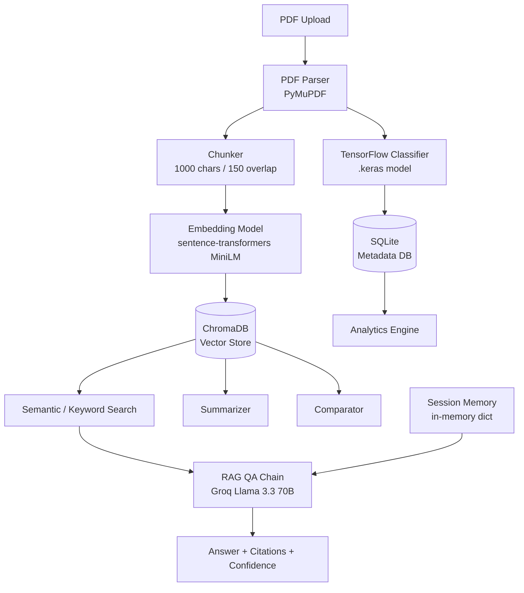

# AI Research & Knowledge Assistant

A production-oriented backend for uploading, searching, and reasoning over technical documents using Retrieval-Augmented Generation (RAG), semantic search, and a custom TensorFlow document classifier.

## 1. Project Overview

This system lets a user upload PDF documents, which are automatically parsed, classified into technical domains via a trained TensorFlow model, chunked, embedded, and indexed into a vector database. Users can then:

- Ask natural-language questions answered strictly from retrieved document context, with citations (document + page number)
- Run semantic or keyword search across one or more documents
- Generate multi-section summaries (Executive, Technical, Bullet Points, Key Takeaways)
- Compare two or more documents across methodology, pros/cons, similarities, and differences
- View system-wide analytics (document/chunk counts, category distribution, most-queried documents)
- Maintain multi-turn conversation context (follow-up questions resolve pronouns like "its" correctly)

Built with FastAPI, ChromaDB, Sentence-Transformers, Groq (Llama 3.3 70B), and TensorFlow/Keras.

## 2. Architecture Diagram



## 3. Technology Stack

| Layer | Component | Purpose |
|---|---|---|
| Backend Framework | FastAPI + Uvicorn | REST API, async handlers, auto Swagger docs |
| PDF Processing | PyMuPDF (fitz) | Text + page-level metadata extraction |
| Chunking | Custom (fixed-size + overlap) | Splits text while preserving page citations |
| Embeddings | sentence-transformers (all-MiniLM-L6-v2) | Local, free, no billing required |
| Vector Database | ChromaDB (persistent client) | Semantic similarity search |
| LLM Engine | Groq API (llama-3.3-70b-versatile) | RAG answer generation, summarization, comparison |
| ML Classification | TensorFlow / Keras (TextVectorization + Dense) | Document domain classification |
| Metadata DB | SQLite + SQLAlchemy | Document metadata, query logs |
| Testing | pytest | Unit tests for parser, ML, vector store |


## 4. Setup Instructions

### Prerequisites
- Python 3.11 (required for TensorFlow compatibility)
- ~5 GB free disk space
- A free Groq API key (console.groq.com)

### Installation

```bash
git clone <your-repo-url>
cd ai-research-assistant

py -3.11 -m venv venv
venv\Scripts\activate          # Windows
# source venv/bin/activate     # macOS/Linux

pip install -r requirements.txt --no-cache-dir
```

### Environment Setup

Copy `.env.example` to `.env` and fill in your Groq API key:

```bash
copy .env.example .env
```

### Train the TensorFlow Classifier (one-time, ~5 minutes)

```bash
python -m src.ml.dataset_prep       # pulls ~560 labelled abstracts from arXiv
python -m src.ml.train_classifier   # trains and saves models/tf_classifier.keras
```

### Run the Application

```bash
python -m uvicorn main:app --reload
```

Open Swagger UI at: `http://127.0.0.1:8000/docs`

### Run Tests

```bash
python -m pytest tests\ -v
```


## 5. Environment Variables

| Variable | Description | Example |
|---|---|---|
| `GROQ_API_KEY` | API key for Groq LLM calls | `gsk_...` |
| `GROQ_MODEL` | Groq model identifier | `llama-3.3-70b-versatile` |
| `EMBEDDING_MODEL` | Sentence-transformers model name | `sentence-transformers/all-MiniLM-L6-v2` |
| `RAW_DOCUMENTS_DIR` | Path for uploaded PDF storage | `./data/raw_documents` |
| `VECTOR_DB_DIR` | ChromaDB persistence directory | `./data/vector_db` |
| `DATASET_DIR` | TensorFlow training dataset location | `./data/dataset` |
| `TF_MODEL_PATH` | Saved classifier model path | `./models/tf_classifier.keras` |
| `TOKENIZER_PATH` | Saved label mapping path | `./models/tokenizer.pickle` |
| `DATABASE_URL` | SQLite connection string | `sqlite:///./data/app.db` |
| `CHUNK_SIZE` | Characters per chunk | `1000` |
| `CHUNK_OVERLAP` | Overlap between chunks | `150` |
| `TOP_K` | Default retrieval count | `4` |


## 6. API Documentation

Full interactive documentation is auto-generated at `/docs` (Swagger) and `/openapi.json` (raw spec, importable into Postman).

### Document Management
| Method | Endpoint | Description |
|---|---|---|
| POST | `/documents/upload` | Upload a PDF; triggers background processing (parse ? classify ? chunk ? embed ? index) |
| GET | `/documents/` | List all documents with metadata |
| GET | `/documents/{doc_id}` | Get metadata for one document |
| DELETE | `/documents/{doc_id}` | Delete a document's file, vector chunks, and metadata |
| POST | `/documents/{doc_id}/reprocess` | Re-run the full processing pipeline on an existing document |

### Search & Question Answering
| Method | Endpoint | Description |
|---|---|---|
| POST | `/search/semantic` | Vector similarity search across chunks |
| POST | `/search/keyword` | Exact substring search across chunks |
| POST | `/search/ask` | RAG question answering with citations, confidence score, and session memory |

### Analysis
| Method | Endpoint | Description |
|---|---|---|
| POST | `/analysis/summarize` | Generate Executive/Technical/Bullet/Key Takeaways summary |
| POST | `/analysis/compare` | Compare 2+ documents (methodology, pros/cons, similarities, differences) |
| POST | `/analysis/classify` | Re-run TensorFlow classification on a document |

### Analytics
| Method | Endpoint | Description |
|---|---|---|
| GET | `/analytics/summary` | Document/chunk counts, category distribution, most-queried docs, total questions answered |


## 7. Assumptions

- Uploaded documents are text-based PDFs (not scanned/image-only); OCR was out of scope given the project timeline.
- Single-user system — no authentication layer was implemented (listed as a bonus feature in the spec).
- Conversation memory is scoped per `session_id` provided by the client, not tied to user accounts.
- The TensorFlow classifier's 7 categories match the assignment's example list; documents outside these domains will still receive a best-effort classification.

## 8. Design Decisions

**Groq (Llama 3.3 70B) instead of OpenAI GPT-4o.** The reference architecture suggested OpenAI for both embeddings and generation. OpenAI requires a paid billing account, which wasn't available for this project. Groq offers a free, fast API with an OpenAI-compatible response structure, so it was used as a drop-in replacement for the LLM layer with no architectural compromise — the RAG chain's contract (context in, grounded answer + citations out) is unchanged.

**sentence-transformers (all-MiniLM-L6-v2) instead of OpenAIEmbeddings.** Same reasoning as above — this model runs locally, is free, and is a widely-used, well-benchmarked choice for semantic search at this scale.

**Fixed-size character chunking (1000 chars, 150 overlap) instead of sentence/semantic-aware chunking.** Simpler to implement and reason about under time constraints, fully deterministic, and the overlap prevents context loss across chunk boundaries. A more advanced sentence-boundary-aware or semantic chunker is a natural next step (see Future Improvements).

**Native `.keras` format instead of legacy `.h5` for the TensorFlow model.** The classifier's first layer is a `TextVectorization` layer operating directly on raw strings. TF 2.17's HDF5 (`.h5`) save path had reliability issues with this layer type (Unicode encoding failures during serialization on Windows); the native Keras format handles it correctly and is also TensorFlow's currently recommended format.

**In-memory dict for conversation history instead of SQL-backed session storage.** A `ConversationMemory` table exists in the schema for future persistence, but given the time budget, an in-memory dictionary keyed by `session_id` was used for the actual working implementation. This satisfies the functional requirement (follow-up questions resolve correctly) without the added complexity of session lifecycle management in SQL.

**Confidence score as a retrieval-distance proxy.** Rather than a separate calibration model, RAG answer confidence is derived from the average cosine distance of retrieved chunks (normalized to 0–1). This is a lightweight, defensible approximation — lower retrieval distance (closer semantic match) maps to higher confidence.

## 9. Limitations

- The TensorFlow classifier was trained on ~560 arXiv paper abstracts (80 per category) due to time constraints. Validation accuracy (~55%) reflects this small dataset size — a larger, more diverse labelled corpus would improve real-world generalization, especially for non-academic documents (e.g., resumes, business documents) which the model wasn't trained on.
- No hybrid search (BM25 + vector) — only semantic and keyword search modes are implemented, as hybrid retrieval was listed as a bonus feature.
- No authentication or multi-user support — single-session usage is assumed.
- Conversation memory does not persist across server restarts (in-memory only).
- Confidence scores across all endpoints are heuristic approximations, not calibrated probability estimates.

## 10. Future Improvements

- Replace fixed-size chunking with a sentence- or semantic-boundary-aware splitter.
- Add hybrid search (BM25 + dense vector) and a reranking model for improved retrieval precision.
- Persist conversation memory to the existing `ConversationMemory` SQL table for durability across restarts.
- Expand the TensorFlow training dataset (more samples per category, broader document types beyond academic abstracts) to improve classification accuracy and generalization.
- Add authentication (JWT) and multi-user document isolation.
- Add OCR support (e.g., Tesseract) for scanned/image-based PDFs.
- Containerize with Docker and add a CI/CD pipeline for automated testing and deployment.

## 11. Sample Documents

Sample PDF included: `data/raw_documents/Abhishek_CV_OnePage.pdf` (used during development and testing).
